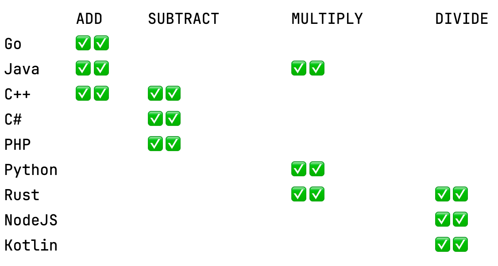

# Distributed Calculator

This demo project is an adaptation of the [distributed-calculator tutorial](https://github.com/dapr/quickstarts/blob/master/tutorials/distributed-calculator) from the [beautiful collection of Dapr quickstarts and tutorials](https://github.com/dapr/quickstarts). It showcases Fleet as a multi-language IDE and demonstrates features such as smart mode, run configurations, debugging, integration with Git and Docker, remote development, and remote collaboration.


The original distributed-calculator project demonstrates method invocation and state persistence capabilities of the [Dapr engine](https://docs.dapr.io/) via a distributed calculator where each operation is powered by a different service written in a different language/framework. In this adaptation, we provide a more extensive list of service implementations:

- A C++ [Crow](https://crowcpp.org/) application, implementing addition and subtraction.
- A Rust [actix_web](https://actix.rs/) application, implementing multiplication and division.
- A Go [mux](https://github.com/gorilla/mux) application, implementing addition.
- A Java [Spark](https://sparkjava.com/) application, implementing addition and multiplication.
- A Kotlin [Ktor](https://ktor.io/) application, implementing division.
- A C# [ASP.NET 7.0](https://docs.microsoft.com/en-us/dotnet/core/) application, implementing subtraction.
- A Python [flask](https://flask.palletsprojects.com/en/2.2.x/) application, implementing multiplication.
- A PHP [Symfony](https://symfony.com/) application, implementing subtraction.
- A Node [Express](https://expressjs.com/) application, implementing division.

Each backend application listens to its own port and responds to one or several POST requests (`/add`, `/multiply`, `/subtract`, `/divide`) with a JSON-encoded body like the following:

```json
{
    "operandOne":"52",
    "operandTwo":"34"
}
```

The result is a single number.

The front-end application consists of a server and a client written in [React](https://reactjs.org/).
Credit goes to [ahfarmer](https://github.com/ahfarmer) for the [React calculator](https://github.com/ahfarmer/calculator).

The diagram below showcases the architecture of the original project:


## Prerequisites for Running the Project

1. Install [Dapr CLI](https://github.com/dapr/cli)
2. Install [.NET SDK 7.0](https://dotnet.microsoft.com/download)
3. Install [Go](https://golang.org/doc/install)
4. Install [Python3](https://www.python.org/downloads/) and [Pipenv](https://pypi.org/project/pipenv/)
5. Install [Npm](https://www.npmjs.com/get-npm)
6. Install [Node](https://nodejs.org/en/download/)
7. Install [Rust](https://rustup.rs/)
8. Install [PHP](https://www.php.net/manual/en/install.php) and [composer](https://getcomposer.org/download/)
9. Install [cmake](https://cmake.org/) and [conan](https://conan.io/)
10. Install [Docker](https://www.docker.com/)
11. Run [`./deps.sh`](deps.sh) to install additional project dependencies.

## Running the Project

1. Initialize the Dapr runtime by running `dapr init`. This commands installs the required runtime binaries and launches the Dapr services including Redis and Zipkin in Docker containers.

2. There are numerous Run Configurations (**Run/Run & Debug...**) to run frontend and backend applications alongside the Dapr sidecar instances. Alternatively, one can use the `./start-service.sh` script:

```bash
./start-service.sh frontendapp
```

```bash
./start-service.sh kotlin-calc
```

3. Open a browser window and navigate to http://localhost:8080/. When here, different operations can be entered. If running the project from a cloud environment, it may be needed to **Forward Port** 8080 to a local port (this can be done via the **Go to/Actions...** menu).

4. Open the console of the browser (typically accessed with the F12 key) to examine logs that are produced as the calculator is used. Observe that with each button press, logs are generated that indicate state persistence and the various apps that have been contacted to carry out the operation.

5. **Optional:** Validate services

To ensure all the backend applications function properly, the **Validate Services** Run Configuration can be used. This will test all the operations and report if anything is missing. This configuration executes the `./validate-services.sh` script. If everything is working correctly, the following output should be seen:


    
6. **Optional:** Check persistent state (powered by Redis)

- To check the persistent state, the following `curl` command can be run:
```bash
curl -s http://localhost:8080/state
```

Sample response:
```bash
{"operation":null,"service":null,"total":"42","next":null}
```

- Another option is to use `redis-cli` in the Redis Docker container. Open the **Docker** tool in one of the side panels, find the `dapr_redis` container, and once selected, open a terminal (the button to do this is located to the right of the container's name and port number).

Sample session in the terminal:
```bash
root@a20170d47d09:/data# redis-cli
127.0.0.1:6379> keys *
1) "frontendapp||calculatorState"
127.0.0.1:6379> hgetall "frontendapp||calculatorState"
1) "version"
2) "281"
3) "data"
4) "{\"total\":\"2\",\"next\":\"3\",\"operation\":\"+\",\"service\":\"go\"}"
127.0.0.1:6379>
```

7. Cleanup

- To clean up microservices, use the **Stop Services** Run Configuration (which executes `./stop-services.sh`).
- To uninstall Dapr and remove its Docker services, use:
  ```bash
  dapr uninstall --all
  ```