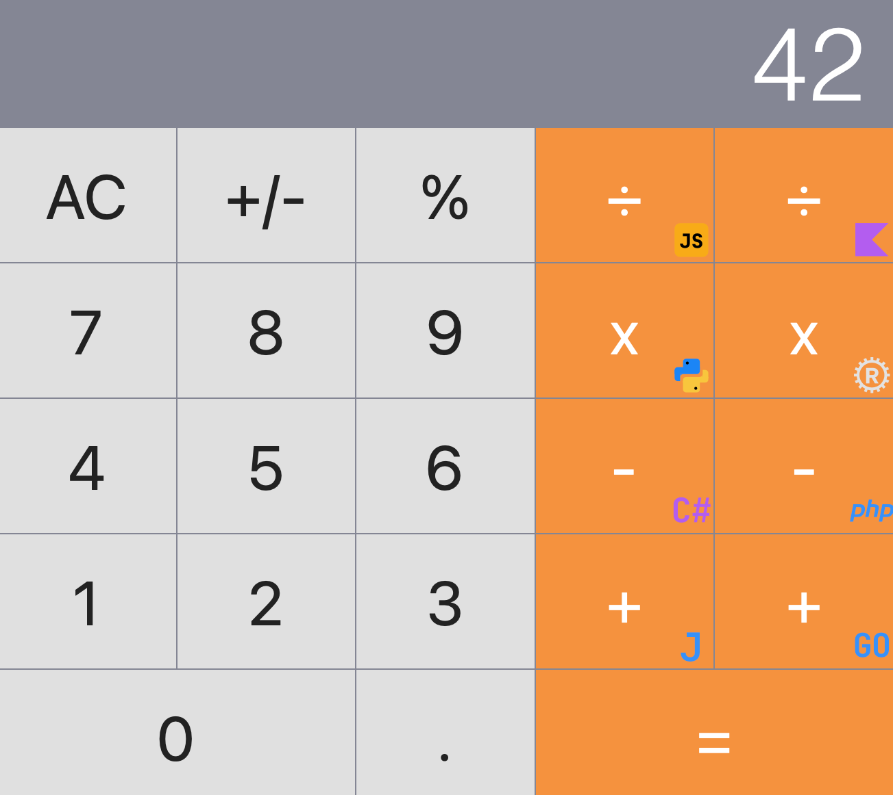

# Distributed calculator

This demo project is an adaptaion of the [distributed-calculator tutorial](https://github.com/dapr/quickstarts/blob/master/tutorials/distributed-calculator) from the [beatiful collection of Dapr quickstarts and tutorials](https://github.com/dapr/quickstarts). It showcases Fleet as a polyglot IDE and such its features as smart mode, run configurations, debugging, integration with Git and Docker, remote development and remote collaboration.




The original distributed-calculator project shows method invocation and state persistent capabilities of [Dapr engine](https://docs.dapr.io/) through a distributed calculator where each operation is powered by a different service written in a different language/framework. In this adaptation, we provide twice more service implementations:

- **Addition** (`/add`):
    - Go [mux](https://github.com/gorilla/mux) application
    - Java [Spark](https://sparkjava.com/) application
- **Multiplication** (`/multiply`):
    - Python [flask](https://flask.palletsprojects.com/en/2.2.x/) application
    - Rust [actix_web](https://actix.rs/) application
- **Division** (`/divide`):
    - Node [Express](https://expressjs.com/) application
    - Kotlin [Ktor](https://ktor.io/) application
- **Subtraction** (`/subtract`):
    - [ASP.NET 7.0](https://docs.microsoft.com/en-us/dotnet/core/) application
    - PHP [Symfony](https://symfony.com/) application

Every backend application listens its own port and answers one kind of POST requests with the JSON-encoded body like the following:
    ```json
    {
        "operandOne":"52",
        "operandTwo":"34"
    }
    ```

The result is a single number.

The front-end application consists of a server and a client written in [React](https://reactjs.org/).
Kudos to [ahfarmer](https://github.com/ahfarmer) for [React calculator](https://github.com/ahfarmer/calculator).

The following architecture diagram illustrates the components that make up the original project:


## Prerequisites for running the project

**All the following prerequisites will be available when opening this project in IDE using Space Dev Environments and the prepared warm-up snapshot.**

1. Install [Dapr CLI](https://github.com/dapr/cli)
2. Install [.NET SDK 7.0](https://dotnet.microsoft.com/download)
3. Install [Go](https://golang.org/doc/install)
4. Install [Python3](https://www.python.org/downloads/) and [Pipenv](https://pypi.org/project/pipenv/)
5. Install [Npm](https://www.npmjs.com/get-npm)
6. Install [Node](https://nodejs.org/en/download/)
7. Install [Rust](https://rustup.rs/)
8. Install [PHP](https://www.php.net/manual/en/install.php) and [composer](https://getcomposer.org/download/)
9. Install [Docker](https://www.docker.com/)
10. The content of the `./deps.sh` script can give you an idea of how to install project dependencies:

    ```bash
    #!/bin/sh
    cd python
    pipenv install
    cd ../node
    npm install
    cd ../php
    composer update
    cd ../react-calculator
    npm install
    npm run buildclient
    ```

## Running the project

1. Initialize the Dapr runtime by running `dapr init`. This installs the required runtime binaries and launches the Dapr services including Redis and Zipkin in Docker containers.

2. There are many Run Configurations (**Run/Run & Debug...**) to run frontend and backend applications along the dapr sidecar instances. One can also use the `./start-service.sh` script:

    ```bash
    ./start-service.sh frontendapp
    ```

    ```bash
    ./start-service.sh kotlin-calc
    ```

3. Open a browser window and go to http://localhost:8080/. From here, you can enter the different operations. If you run the project from the Space Dev environment, you will also need to **Forward Port** 8080 to some local port (via **Go to/Actions...** menu).

4. Open your browser's console window (using F12 key) to see the logs produced as you use the calculator. Note that each time you click a button, you see logs that indicate state persistence and the different apps that are contacted to perform the operation.

5. **Optional:** Validate Services

To make sure all the backend applications are working, you can run the **Validate Services** run configuration which will test all the operations and report if something is missing. This configuration executes the `./validate-services` script. If everything works correctly you should get the following output:

                            direct  via frontend
    ADD             Go      ✅       ✅
    ADD             Java    ✅       ✅
    SUBTRACT        C#      ✅       ✅
    SUBTRACT        PHP     ✅       ✅
    MULTIPLY        Python  ✅       ✅
    MULTIPLY        Rust    ✅       ✅
    DIVIDE          NodeJS  ✅       ✅
    DIVIDE          Kotlin  ✅       ✅
    
6. **Optional:** Check persistent state (powered by redis)

- To check persistent state, you can run the following `curl` request:
    ```bash
    curl -s http://localhost:8080/state
    ```
  Sample response:
    ```bash
    {"operation":null,"service":null,"total":"42","next":null}
    ```

- Another option is to run `redis-cli` in the Redis docker container. Open the **Docker** tool in one of the side panels, find the `dapr_redis` container, focus on it, and open a terminal (button to the right of the container's name and port number). Sample session in the terminal:
  ```bash
  root@a20170d47d09:/data# redis-cli
  127.0.0.1:6379> keys *
  1) "frontendapp||calculatorState"
  127.0.0.1:6379> hgetall "frontendapp||calculatorState"
  1) "version"
  2) "281"
  3) "data"
  4) "{\"total\":\"2\",\"next\":\"3\",\"operation\":\"+\",\"service\":\"go\"}"
  127.0.0.1:6379>
  ```

7. Cleanup

- Cleanup microservices: **Stop Services** run configuration (executes `./stop-services.sh`).
- Uninstall Dapr and remove its Docker services:
  ```bash
  dapr uninstall --all
  ```